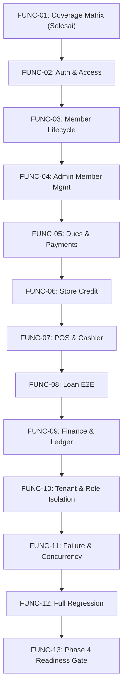

# FUNC-01 — Functional Test Contract & Coverage Matrix

## 1. Document Control & Baseline Metadata

| Attribute | Value |
| :--- | :--- |
| **Document ID** | `FUNC-01` |
| **Title** | Authoritative Functional Test Contract & Coverage Matrix |
| **Phase** | Phase 4 — Functional Test & Fix |
| **Repository** | `johnd-creator/kojaya` |
| **Baseline Branch** | `main` |
| **Baseline Git SHA** | `62cc9550593c2f88eb6cc2db9e6cf7cc84c3142d` |
| **Working Branch** | `test/func-01-functional-coverage` |
| **Target Scope** | Tasks `FUNC-02` through `FUNC-13` |
| **Status** | **AUTHORITATIVE / APPROVED** |
| **Production Code Changes** | **0 files (Strict Audit Only)** |

---

## 2. Executive Summary & Purpose

Phase 3 (Seed & Test Data) resmi ditutup melalui `SEED-09` dan `SEED-09R1` dengan dataset kanonikal yang terbukti deterministik, terrekonsiliasi secara finansial, dan dilindungi oleh pengaman lingkungan produksi (*environment safety guard*).

Tujuan utama dari **FUNC-01** adalah menyusun **peta kontrak pengujian fungsional otoritatif (*authoritative functional test contract*)** yang memetakan seluruh kapabilitas fungsional aplikasi Kojaya saat ini (baik portal web staf KojayaPro, portal swalayan anggota Kojayaku, maupun endpoint REST/Sanctum API). Dokumen ini menjadi rujukan tunggal dan pengendali (*governing specification*) bagi pelaksanaan perbaikan dan pengujian mendalam pada tugas-tugas berikutnya:

- **FUNC-02**: Authentication & Access Control
- **FUNC-03**: Member Lifecycle & Member Profile
- **FUNC-04**: Admin Member Management & Batch Operations
- **FUNC-05**: Contributions, Dues & Payment Gateway Integration
- **FUNC-06**: Store Credit & Member Store Account
- **FUNC-07**: POS & Cashier Workflow
- **FUNC-08**: Loan End-to-End Lifecycle & Maker-Checker
- **FUNC-09**: Finance, Ledger, Receipts & Reconciliation
- **FUNC-10**: Multi-Tenant Organization & Permission Isolation
- **FUNC-11**: Failure, Concurrency, Recovery & Edge Conditions
- **FUNC-12**: Full Regression Suite
- **FUNC-13**: Phase 4 Readiness Gate

---

## 3. Authoritative Functional Coverage Matrix

### 3.1. Klasifikasi Status & Risiko

**Status Cakupan (*Coverage Status*)**:
- `COVERED`: Perilaku fitur telah dilindungi uji otomatis fungsional yang valid dan bermakna.
- `PARTIAL`: Fitur memiliki beberapa pengujian, namun cabang penting, efek samping akuntansi, autorisasi, atau kondisi gagal belum teruji.
- `MISSING`: Fitur ada di basis kode produksi tetapi belum memiliki pengujian fungsional otomatis yang memadai.
- `NOT_APPLICABLE`: Fitur/skenario tidak berlaku pada arsitektur atau aturan bisnis Kojaya saat ini.
- `BLOCKED`: Fitur belum dapat diuji secara bermakna karena ada ketergantungan konkret yang belum tersedia.

**Tingkat Risiko (*Risk Severity*)**:
- `P0`: Risiko fatal (akses tidak sah, kebocoran data lintas tenant/anggota, korupsi finansial/buku besar ireversibel, penagihan ganda).
- `P1`: Alur bisnis inti gagal atau menghasilkan state data persisten yang salah.
- `P2`: Fitur terdegradasi namun dapat dipulihkan tanpa korupsi data material.
- `P3`: Inkonsistensi minor pada tampilan UI, pesan validasi, atau perilaku non-kritis.

---

### 3.2. Master Functional Coverage Table

| ID | Domain | Feature / Journey | Actor | Entry Point | Authorization | Data / Models | Side Effects | Existing Tests | Missing Coverage | Risk | Phase 4 Task | Status |
| :--- | :--- | :--- | :--- | :--- | :--- | :--- | :--- | :--- | :--- | :---: | :---: | :---: |
| **AUTH-001** | Auth | Web Login & Role-Based Redirection | All Users | `POST /login` (`AuthenticatedSessionController@store`) | Public / Web Guest | `User`, `CooperativeMember`, `Role` | Session created, audit log, redirection based on role/member status | `AuthenticationTest`, `P5MemberAuthRedirectTest`, `AuthenticationAndAccessFunctionalTest` | None (Fully covered: active member redirect, non-active lifecycle onboarding redirect, staff dashboard redirect, intended URL handling) | P1 | FUNC-02 | **COVERED** |
| **AUTH-002** | Auth | Web Logout & Session Invalidation | Auth Users | `POST /logout` (`AuthenticatedSessionController@destroy`) | `auth:web` | `Session` | Session destroyed, CSRF token regenerated | `AuthenticationTest`, `AuthenticationAndAccessFunctionalTest` | None (Fully covered: session destroyed, CSRF regenerated, subsequent request denied) | P2 | FUNC-02 | **COVERED** |
| **AUTH-003** | Auth | Two-Factor Authentication (2FA) Setup & Challenge | Staff / Members | `POST /user/two-factor-authentication`, `POST /two-factor-challenge` | `auth:web`, `password.confirm` | `User` (2FA secrets/recovery codes) | 2FA enabled, secret generated, recovery codes stored | `TwoFactorAuthenticationTest`, `TwoFactorChallengeTest`, `AuthenticationAndAccessFunctionalTest` | None (Fully covered: challenge redirect, recovery code login & consumption, invalid code rejection, rate limiting) | P1 | FUNC-02 | **COVERED** |
| **AUTH-004** | Auth | Google SSO Redirection & Callback | Anggota | `GET /auth/google/redirect`, `GET /auth/google/callback` | Public / Web Guest | `User`, `SocialAccount`, `CooperativeMember` | Creates or links social account, initiates member session | `GoogleSsoFlowTest`, `GoogleSsoMemberMatchingTest`, `GoogleSsoOpenRedirectHardeningTest`, `AuthenticationAndAccessFunctionalTest` | None (Fully covered: redirect to provider, tampered state fail-closed with audit log, unverified email rejection) | P1 | FUNC-02 | **COVERED** |
| **AUTH-005** | Auth | Mobile API Token Issuance (Password) | Mobile Users | `POST /api/auth/login` (`AuthController@login`) | Public / API Guest | `User`, `PersonalAccessToken` | Issues Sanctum token with `TokenApp` abilities | `MemberTokenAbilityTest`, `Phase0MobileApiTest`, `AuthenticationAndAccessFunctionalTest` | None (Fully covered: Bearer token issuance, member abilities, fail-closed credentials, rate limiting) | P1 | FUNC-02 | **COVERED** |
| **AUTH-006** | Auth | Inactive / Blocked Member Access Denial | Anggota | `POST /login`, `POST /api/auth/login` | Fortify / Sanctum | `User`, `CooperativeMember` | 403 Forbidden / Login rejection with exact error code | `MemberFirstLoginLifecycleExperienceTest`, `MemberLifecycleTokenRevocationTest`, `AuthenticationAndAccessFunctionalTest` | None (Fully covered: web login 403 & session termination, mobile API 403 with MemberNotActive code, mid-session token revocation, member portal 403) | P0 | FUNC-02 | **COVERED** |
| **AUTH-007** | Auth | API Token Revocation (Logout) | Mobile Users | `POST /api/auth/logout` (`AuthController@logout`) | `auth:sanctum` | `PersonalAccessToken` | Token revoked/deleted from DB | `Phase0MobileApiTest`, `MemberLifecycleTokenRevocationTest`, `AuthenticationAndAccessFunctionalTest` | None (Fully covered: single token revocation, logout-all across devices, immediate 401 on revoked token) | P2 | FUNC-02 | **COVERED** |
| **AUTH-008** | Auth | Password Confirmation & Reset Link | All Users | `POST /forgot-password`, `POST /reset-password` | Public / Guest | `User`, `password_reset_tokens` | Reset token generated, email dispatched | `PasswordResetTest`, `PasswordConfirmationTest`, `AuthenticationAndAccessFunctionalTest` | None (Fully covered: reset flow with token, invalid token rejection, password confirmation endpoint) | P2 | FUNC-02 | **COVERED** |
| **MEM-001** | Lifecycle | Member Onboarding View & Eligibility | Anggota | `GET /member/onboarding` (`MemberPortalController@onboarding`) | `auth:web`, `member` | `CooperativeMember`, `User` | Renders onboarding steps based on current lifecycle stage | `MemberOnboardingAccessTest`, `MemberLifecycleAndProfileFunctionalTest` | None (Fully covered: non-active lifecycle view access, active member redirect to dashboard, blocked member 403, unauthenticated redirect to login) | P2 | FUNC-03 | **COVERED** |
| **MEM-002** | Lifecycle | Member Onboarding Form Submission | Anggota | `POST /member/onboarding` (`MemberPortalController@submitOnboarding`) | `auth:web`, `member` | `CooperativeMember`, `User` | Updates safe profile fields, sets state to `WAITING_VERIFICATION` | `MemberOnboardingAccessTest`, `MemberOnboardingSubmitTest`, `MemberLifecycleAndProfileFunctionalTest` | None (Fully covered: safe profile updates, timestamps, immutable fields ignored without mutation, duplicate NIK submission across organizations cannot mutate identity, status non-self-advancing, active/under-review/rejected/blocked denied) | P0 | FUNC-03 | **COVERED** |
| **MEM-003** | Lifecycle | Member Profile Retrieval (Self-Service) | Anggota | `GET /member/profile`, `GET /api/v1/member/profile` | `auth:web`/`auth:sanctum`, `member.active` | `CooperativeMember`, `User` | Returns member profile, savings summary, badges | `Phase1MemberSelfServiceApiTest`, `MemberLifecycleAndProfileFunctionalTest` | None (Fully covered: authoritative server identity resolution, query tamper ignored, non-member 403, completeness percentage accuracy) | P3 | FUNC-03 | **COVERED** |
| **MEM-004** | Lifecycle | Member Profile Update (Phone / Address) | Anggota | `PUT /member/profile`, `PUT /api/v1/member/profile` | `auth:web`/`auth:sanctum`, `member.active` | `CooperativeMember` | Updates editable fields, logs audit change | `Phase1MemberSelfServiceApiTest`, `MemberLifecycleAndProfileFunctionalTest` | None (Fully covered: web/API update of safe fields, immutable fields tamper prevention on member_no/status/org/user_id, SSO email lock) | P0 | FUNC-03 | **COVERED** |
| **MEM-005** | Lifecycle | Member Status Experience Resolution | Anggota | Internal Service (`MemberLifecycleExperience::fromMember`) | Framework / Policy | `CooperativeMember` | Resolves canonical experience enum | `CooperativeMemberLifecycleSeederTest`, `SeedIntegrityGateTest`, `MemberLifecycleAndProfileFunctionalTest` | None (Fully covered: deterministic resolution of all canonical pairs, validation notes update leaves experience unchanged) | P2 | FUNC-03 | **COVERED** |
| **MEM-006** | Lifecycle | Member Resignation Request Submission | Anggota | `POST /cooperative/members/{member}/resign`, `POST /api/v1/member/resignation` | `auth:web`/`auth:sanctum`, `member.active` | `MemberResignationRequest`, `CooperativeMember` | Creates pending resignation request | `MemberResignationAuthorizationTest`, `MemberResignationControllerTest`, `MemberLifecycleAndProfileFunctionalTest` | None (Fully covered: resignation submission and admin direct resignation blocked when active obligations exist [loans, pending reward redemptions, unpaid dues invoices], duplicate/already-resigned prevention, cancellation) | P0 | FUNC-03 | **COVERED** |
| **MEM-007** | Lifecycle | Member Account Link to SSO | Anggota | `POST /cooperative/members/{member}/link-account` | `auth:web`, `manage_cooperative_member` | `SocialAccount`, `CooperativeMember` | Links Google provider ID to member record | `MemberAccountLinkAuthorizationTest`, `MemberLifecycleAndProfileFunctionalTest` | None (Fully covered: verified user in same organization linked, cross-organization rejected, unverified rejected, bound user rejected, privileged roles rejected) | P0 | FUNC-03 | **COVERED** |
| **MEM-008** | Lifecycle | Member Status Consistency Check | System | Internal Scan (`MemberStatusConsistencyReport`) | Cron / CLI / Test | `CooperativeMember` | Reports inconsistencies between status and lifecycle dates | `MemberStatusConsistencyTest`, `MemberLifecycleAndProfileFunctionalTest` | None (Fully covered: valid/inconsistent pairs detection, deterministic terminal status repairs via members:backfill-status-consistency, CLI audit command execution; automated repair of corrupted lifecycle dates does not exist by design and is classified as requiring manual review via manualReviewQuery to preserve audit veracity) | P2 | FUNC-03 | **COVERED** |
| **ADM-001** | Admin Member | Member Directory Listing & Filters | Admin / Pengurus | `GET /cooperative/members` (`CooperativeMemberController@index`) | `view_cooperative_member` | `CooperativeMember` | Renders paginated list, filters by status, branch, search | `AdminMemberManagementFunctionalTest`, Visual Tests (`members.visual.spec.ts`) | None (Fully covered: paginated list at 15/page, text search across nama/no_anggota/email/phone, exact NIK blind-index search for PII viewers + audit log, status/validation_status/jenis_anggota/kategori filters, multi-filter combos, multi-tenant isolation, unauthorized 403) | P2 | FUNC-04 | **COVERED** |
| **ADM-002** | Admin Member | Member Registration (Admin Direct) | Admin / Pengurus | `POST /cooperative/members` (`CooperativeMemberController@store`) | `manage_cooperative_member` | `CooperativeMember`, `User` | Creates member, generates `member_no`, creates user account | `AdminMemberManagementFunctionalTest`, `MemberP0SecurityClosureTest` | None (Fully covered: direct registration validation, duplicate `no_anggota` 422 rejection, prohibited fields rejection on user_id/member_no/status/validation_status/identity_number/npwp, one-time POKOK dues invoice creation side effect, transaction boundary rollback on invalid input, tenant scoping, unauthorized 403) | P1 | FUNC-04 | **COVERED** |
| **ADM-003** | Admin Member | Member Detail & Sensitive Data Masking | Admin / Pengurus | `GET /cooperative/members/{member}` (`CooperativeMemberController@show`) | `view_cooperative_member` | `CooperativeMember` | Shows member details, masks NIK/phone if no PII permission | `AdminMemberManagementFunctionalTest`, Visual Tests | None (Fully covered: server-side PII masking for roles without PII view permission [masked identity_number, npwp, no_rekening; nullified nama_bank, nama_pemilik_rekening, address, notes; no audit log], unmasked PII view for authorized roles with `member.pii.viewed` audit log, cross-organization 403 rejection, unauthorized 403) | P0 | FUNC-04 | **COVERED** |
| **ADM-004** | Admin Member | Member Validation Review (Under Review) | Admin Koperasi | `POST /cooperative/members/{member}/validate` | `validate_cooperative_member` | `CooperativeMember`, `ApprovalLog` | Sets validation status to `UNDER_REVIEW`, records reviewer | `CooperativeMemberValidationTest`, `AdminMemberManagementFunctionalTest` | None (Fully covered: transition from `VALIDATION_PENDING` to `VALIDATION_PENDING_REVIEW`, admin verifier audit tracking, transition attempt from already `ACTIVE` status rejected with 409 Conflict, unauthorized 403) | P1 | FUNC-04 | **COVERED** |
| **ADM-005** | Admin Member | Member Revision Request | Admin Koperasi | `POST /cooperative/members/{member}/revision` | `validate_cooperative_member` | `CooperativeMember`, `ApprovalLog` | Sets status `REVISION_REQUIRED`, stores notes for member | `CooperativeMemberValidationTest`, `AdminMemberManagementFunctionalTest` | None (Fully covered: revision transition to `VALIDATION_REVISION` and `INACTIVE` status, notes validation [min: 5, max: 1000 characters], rejection if not in `VALIDATION_PENDING_REVIEW` [409], unauthorized 403) | P2 | FUNC-04 | **COVERED** |
| **ADM-006** | Admin Member | Member Final Approval (Pengurus Only) | Pengurus Koperasi | `POST /cooperative/members/{member}/approve` | `approve_cooperative_member` | `CooperativeMember`, `ApprovalLog` | Sets status `ACTIVE`, assigns `activated_at`, activates account | `CooperativeMemberValidationTest`, `AdminMemberManagementFunctionalTest` | None (Fully covered: Pengurus final approval to `ACTIVE` status, assigns `Anggota` role, non-pengurus Admin Koperasi attempt rejected [403], maker-checker segregation preventing verifier from approving final, rejection if not in `VALIDATION_PENDING_REVIEW` [409]) | P0 | FUNC-04 | **COVERED** |
| **ADM-007** | Admin Member | Member Rejection (Pengurus Only) | Pengurus Koperasi | `POST /cooperative/members/{member}/reject` | `approve_cooperative_member` | `CooperativeMember`, `ApprovalLog` | Sets status `REJECTED`, records rejection reason | `CooperativeMemberValidationTest`, `AdminMemberManagementFunctionalTest` | None (Fully covered: rejection transition to `VALIDATION_REJECTED` and `INACTIVE` status, rejection reason character limits [min: 5, max: 1000] and requiredness, rejection attempt when not in `VALIDATION_PENDING_REVIEW` [409]) | P2 | FUNC-04 | **COVERED** |
| **ADM-008** | Admin Member | Member Batch Import (Upload, Preview, Execute) | Admin Koperasi | `POST /cooperative/members/import/upload`, `POST .../execute` | `import_cooperative_member_batch` | `CooperativeMember`, `User` | Bulk imports members, generates credentials, audits import | `MemberImportPreviewTest`, `MemberImportValidatorTest`, `MemberImportExecutionTest`, `MemberImportConcurrencyTest`, `AdminMemberManagementFunctionalTest` | None (Fully covered: preview validation of 12 canonical headers, tamper-resistant preview proof verification, syntax/validation error handling with all-or-nothing transaction rollback [0 partial records inserted], successful atomic import with `member.import.completed` audit log, unauthorized access 403) | P1 | FUNC-04 | **COVERED** |
| **PAY-001** | Payments | Dues Invoices Monthly Batch Generation | Admin Koperasi | `POST /cooperative/dues/generate`, `POST /api/v1/dues/generate` | `manage_cooperative_dues` | `CooperativeDuesInvoice`, `CooperativeMember` | Generates POKOK / WAJIB invoices for active members | `CooperativeFinancialFixtureSeederTest`, `ContributionsDuesPaymentsFunctionalTest` | None (Fully covered: Web & API batch dues generation for period, duplicate generation prevention / idempotency returning 0 created invoices, unauthorized denial 403) | P1 | FUNC-05 | **COVERED** |
| **PAY-002** | Payments | Member Payment Intent Creation (Midtrans) | Anggota | `POST /member/payments/intent`, `POST /api/v1/member/dues/invoices/{invoice}/payment-intent` | `auth:web`/`auth:sanctum`, `member.active` | `PaymentIntent`, `CooperativeDuesInvoice` | Creates Midtrans charge, returns Snap token / QRIS string | `PaymentCanonicalItemTest`, `Phase1MemberSelfServiceApiTest`, `ContributionsDuesPaymentsFunctionalTest` | None (Fully covered: active member payment intent creation for unpaid dues invoice, rejection on already PAID invoice [422/404], prevention of amount tampering using authoritative server balance, cross-member ownership denial [403]) | P0 | FUNC-05 | **COVERED** |
| **PAY-003** | Payments | Midtrans Webhook Notification Processing | Payment Gateway | `POST /api/payments/webhook` (`ProductionIntegrationController@paymentWebhook`) | Signature Verification / Public Callback | `CooperativePayment`, `CooperativeDuesInvoice`, `CooperativeLedgerEntry` | Updates invoice to `PAID`, creates payment record, writes ledger credit | `SimulateMidtransWebhookCommandTest`, `PaymentWebhookFailClosedTest`, `ContributionsDuesPaymentsFunctionalTest` | None (Fully covered: invalid signature fail-closed rejection [400] with zero mutations, valid signed webhook status transition to PAID and reconciliation, exactly-once ledger credit and receipt, webhook replay duplicate idempotency) | P0 | FUNC-05 | **COVERED** |
| **PAY-004** | Payments | Manual Payment Recording (Staff Direct) | Staff (Admin/Kasir) | `POST /cooperative/payments`, `POST /api/v1/dues/payments` | `manage_cooperative_payment` | `CooperativePayment`, `CooperativeDuesInvoice` | Records manual cash/bank transfer payment | `CooperativeFinancialFixtureSeederTest`, `ContributionsDuesPaymentsFunctionalTest` | None (Fully covered: Web staff payment recording immediately approves payment [store calls record+approve], service-level invariant verifies record with status=PENDING does not prematurely post ledger credits, strict validation of required fields and negative amount rejection with zero partial records, unauthorized 403) | P1 | FUNC-05 | **COVERED** |
| **PAY-005** | Payments | Payment Approval & Ledger Credit Posting | Admin Koperasi | `POST /cooperative/payments/{payment}/approve`, `POST .../bulk-approve` | `manage_cooperative_payment` | `CooperativePayment`, `CooperativeLedgerEntry`, `CooperativeReceipt` | Approves payment, creates receipt, posts credit to SAVINGS ledger | `SeedIntegrityGateTest`, `PaymentSortBulkTest`, `ContributionsDuesPaymentsFunctionalTest` | None (Fully covered: single payment approval with ledger credit and receipt issuance, repeated approval idempotency without double ledger posting, bulk-approve atomic transaction with mid-batch rollback on maker-checker failure and zero net side effects, skipping non-pending items, cross-organization rejection 403, self-approval prevention) | P0 | FUNC-05 | **COVERED** |
| **PAY-006** | Payments | Manual Payment Proof Upload by Member | Anggota | `POST /member/payments/proof`, `POST /api/v1/member/payments/proof` | `auth:web`/`auth:sanctum`, `member` | `CooperativePayment`, Storage | Uploads image receipt proof, sets status `PENDING` | `Phase1MemberSelfServiceApiTest`, `ContributionsDuesPaymentsFunctionalTest` | None (Fully covered: valid image & PDF proof upload stored to public disk with PENDING status, rejection of disallowed executable mime types [.php] and oversized files [>4MB] leaving zero payment records and zero stored artifacts, cross-member invoice ownership denial) | P2 | FUNC-05 | **COVERED** |
| **PAY-007** | Payments | Payment Receipt Retrieval & Printing | Member / Staff | `GET /api/v1/member/payments/{payment}/receipt` | `auth`, ownership / staff permission | `CooperativeReceipt` | Generates receipt PDF / metadata | `SeedIntegrityGateTest`, `ContributionsDuesPaymentsFunctionalTest` | None (Fully covered: member retrieval of own approved payment receipt metadata and signed download URL, cross-member access denial [403], pending unapproved payment receipt denial [404]) | P0 | FUNC-05 | **COVERED** |
| **PAY-008** | Payments | Notification Outbox Dispatch on Payment | System | Outbox Worker (`NotificationOutboxService`) | Background Job | `NotificationOutbox` | Dispatches WhatsApp / SMS / Email confirmation | `PaymentNotificationOutboxTest`, `ContributionsDuesPaymentsFunctionalTest` | None (Fully covered: outbox enqueue on payment approval with deduplication key, deterministic catch-path delivery failure and linear retry backoff available_at calculation, unclaimable before backoff expiry, retry success after advancing time with exactly-once delivery, permanent failure transition to FAILED at 5 attempts) | P2 | FUNC-05 | **COVERED** |
| **STORE-001** | Store Credit | Member Store Account Opening & Setup | Admin / Pengurus | `POST /cooperative/store-credit` (`MemberStoreCreditController@store`) | `manage_store_credit` | `MemberStoreAccount` | Creates account with initial credit limit and opening balance | `StoreCreditOpenAccountTest`, `StoreCreditFunctionalTest` | None (Fully covered: account opening with initial credit limit and opening balance, duplicate account opening prevention for same member [422] with zero mutations, cross-organization member tampering fail-closed rejection [404] with zero mutations, negative limit/balance validation [422]) | P1 | FUNC-06 | **COVERED** |
| **STORE-002** | Store Credit | Cash Deposit (Top-up Balance) | Cashier / Admin | `POST /cooperative/store-credit/{account}/cash-funding` (`MemberStoreCreditController@cashFund`) | `cashier_store_credit` | `MemberStoreAccount`, `MemberStoreLedgerEntry`, `MemberStoreFundingRequest` | Credits account balance, creates ledger entry and approved funding request | `StoreCreditLedgerTest`, `StoreCreditFundingAndDelegateTest`, `StoreCreditProofFundingHardeningTest`, `StoreCreditFunctionalTest` | None (Fully covered: immediate cash deposit credit with approved funding request and ledger entry, idempotency key replay defense preventing double credits, zero/negative amount rejection [422], max cash transaction threshold enforcement [100B, 422], unauthorized access rejection [403] with zero mutations, deposit rejection on closed account [422]) | P2 | FUNC-06 | **COVERED** |
| **STORE-003** | Store Credit | Credit Limit Adjustment | Pengurus Koperasi | `POST /cooperative/store-credit/{account}/limit` (`MemberStoreCreditController@changeLimit`) | `manage_store_credit_limit` | `MemberStoreAccount`, `AuditLog` | Updates `credit_limit`, logs audit entry | `StoreCreditAuthorizationTest`, `StoreCreditFunctionalTest` | None (Fully covered: Pengurus credit limit adjustment with audit logging, unauthorized Admin/Kasir role rejection [403] with zero mutations, negative limit rejection [422], limit reduction below current debt blocked without explicit override_below_debt permission [422]) | P0 | FUNC-06 | **COVERED** |
| **STORE-004** | Store Credit | Store Credit POS Purchase Deduction | Cashier POS | `POST /cooperative/pos/transactions` (method: `MEMBER_STORE_ACCOUNT`) | `cashier_store_credit`, `access_cooperative_pos` | `MemberStoreAccount`, `MemberStoreLedgerEntry`, `PosTransaction` | Debits account balance, records transaction reference and depletes inventory stock | `StoreCreditPosIntegrationTest`, `StoreCreditLedgerTest`, `StoreCreditFunctionalTest` | None (Fully covered: purchase deduction within balance and within credit limit with inventory stock depletion, exact available limit boundary transaction [total == balance + limit], over-limit purchase atomic rejection [422] with zero POS transactions, zero ledger entries, zero stock depletion, and zero balance mutations, duplicate POS transaction idempotency defense) | P0 | FUNC-06 | **COVERED** |
| **STORE-005** | Store Credit | Family / Delegate Authorization | Anggota | `POST /api/v1/member/store-account/delegates`, `PUT .../{delegate}`, `POST .../{delegate}/revoke` | `auth:sanctum`, `member.active` | `MemberStoreDelegate`, `MemberStoreLedgerEntry` | Adds, updates, or revokes authorized delegate to make purchases on member's credit | `StoreCreditDelegateHardeningTest`, `StoreCreditFundingAndDelegateTest`, `StoreCreditDelegateOrganizationIsolationTest`, `StoreCreditFunctionalTest` | None (Fully covered: member delegate lifecycle [create, update, revoke], POS purchase with active delegate attribution, revoked/expired delegate purchase rejection [422] with zero mutations, per-transaction and daily limit enforcement [422], cross-member and cross-organization tampering rejection) | P1 | FUNC-06 | **COVERED** |
| **STORE-006** | Store Credit | Store Account Suspension & Reactivation | Admin / Pengurus | `POST /cooperative/store-credit/{account}/suspend`, `POST .../reactivate` | `manage_store_credit` | `MemberStoreAccount`, `AuditLog` | Sets status `SUSPENDED` / `ACTIVE`, blocks or restores credit purchases with audit trail | `StoreCreditAuthorizationTest`, `StoreCreditFunctionalTest` | None (Fully covered: staff suspension with timestamp and audit trail, purchase attempt on suspended account atomic fail-closed rejection [422] with zero mutations, reactivated account purchase restoration without residual corruption, unauthorized role rejection [403]) | P0 | FUNC-06 | **COVERED** |
| **STORE-007** | Store Credit | Store Balance Transfer | Anggota / Admin | `POST /api/v1/member/store-account/transfers`, `POST /cooperative/store-credit-transfers/{funding}/process` | `approve_store_credit_transfer` | `MemberStoreAccount`, `MemberStoreLedgerEntry`, `MemberStoreFundingRequest` | Bank transfer funding top-up: member submits transfer request with proof, authorized staff approves/rejects | `StoreCreditAuthorizationTest`, `StoreCreditFundingAndDelegateTest`, `StoreCreditProofFundingHardeningTest`, `StoreCreditFunctionalTest` | None (Fully covered: contract reconciled from peer-to-peer balance transfer to bank transfer funding top-up; submission with private proof storage and pending status without balance credit, maker-checker prevention of submitter self-approval [422] with zero balance change, authorized reviewer approval with balance credit and ledger entry, rejection handling, repeated processing rejection [422], unauthorized approval rejection [403]) | P1 | FUNC-06 | **COVERED** |
| **STORE-008** | Store Credit | Ledger Balance Integrity Audit | System | Service (`StoreCreditLedgerService`) | Internal Service | `MemberStoreLedgerEntry`, `MemberStoreAccount` | Verifies cached balance against authoritative ledger sum and fails closed on drift | `StoreCreditLedgerTest`, `MemberStoreLedgerSchemaRepairTest`, `StoreCreditFunctionalTest` | None (Fully covered: mathematical balance invariant balance == sum(credits) - sum(debits) verified across full lifecycle, ledger entry immutability preventing update and deletion, reversal entry workflow with idempotency restoring mathematical balance, deterministic drift detection throwing RuntimeException and rolling back transaction on balance mismatch with zero partial mutation. Automatic self-healing / reconstruction is NOT implemented by the current service; deferred to FUNC-09/FUNC-11) | P0 | FUNC-06 | **COVERED** |
| **POS-001** | POS | Cashier Shift Open with Float Amount | Kasir Koperasi | `POST /cooperative/pos/shifts/open` (`PosShiftController@open`) | `access_cooperative_pos` | `PosCashierShift`, `PosAuditLog` | Creates open shift record with initial cash float | `PosPhase5ShiftClosingTest`, `PosCashierFunctionalTest::test_pos001_shift_opening_is_cashier_unique_and_audited` | **Old gap stale and contract corrected**: no register/device field exists; current uniqueness rule is one `OPEN` shift per `cashier_id`, independent of location. Rejected second open creates no shift or `shift.opened` audit. | P1 | FUNC-07 | **COVERED** |
| **POS-002** | POS | Barcode Scanning & Product Catalog Lookup | Kasir Koperasi | Web `GET /cooperative/pos` (`PosRegisterController@index`) and API `GET /api/v1/pos/products` (`PosApiController@products`, optional `search`) | Web `access_cooperative_pos`; API `pos:read` plus `access_cooperative_pos` | `PosProduct`, `PosCategory` | Returns organization-scoped products with `is_active = true` | `PosPhase6OfflineSyncTest`, `PosProductOrganizationIsolationTest`, `PosCashierFunctionalTest::test_pos002_canonical_web_and_api_catalogs_exclude_inactive_products` | **Old route/gap stale and contract corrected**: `/cooperative/pos/products/search` is not registered; canonical web/API lookups already exclude `is_active = false`, with organization scope verified. | P2 | FUNC-07 | **COVERED** |
| **POS-003** | POS | POS Cash Transaction Checkout | Kasir Koperasi | `POST /cooperative/pos/transactions` (`PosRegisterController@store`) | `access_cooperative_pos` | `PosTransaction`, `PosTransactionItem`, `PosPayment`, `PosProduct`, `PosCashierShift` | Creates one completed transaction, depletes stock once, records cash received/change | `PosPhase0PolishingTest`, `PosPhase1FeatureTest`, `PosPhase3InventoryTest`, `PosCashierFunctionalTest::test_pos003_cash_boundaries_are_authoritative_and_atomic` | **Gap closed by automated evidence**: zero/insufficient cash is rejected with zero transaction/payment/item/stock mutation; exact cash has zero change; excess cash records the correct positive change. | P1 | FUNC-07 | **COVERED** |
| **POS-004** | POS | POS Store-Credit Checkout | Kasir Koperasi | Web `POST /cooperative/pos/transactions` (`PosRegisterController@store`) and API `POST /api/v1/pos/transactions` (`PosApiController@store`, idempotent) with `MEMBER_STORE_ACCOUNT` | Web `access_cooperative_pos`, `cashier_store_credit`; API `pos:write` plus `access_cooperative_pos` | `PosTransaction`, `MemberStoreAccount`, `MemberStoreLedgerEntry`, `PosProduct` | Completes sale atomically, debits member store credit, checks limit | `StoreCreditPosIntegrationTest`, `StoreCreditVoidRefundTest`, `StoreCreditConcurrencyTest`, `PosTransactionConcurrencyTest` | **Gap closed by combined evidence**: POS integration proves one transaction/one debit and atomic over-limit rollback; PostgreSQL concurrency evidence proves row-locked store-credit debits cannot exceed authorized credit capacity. | P0 | FUNC-07 | **COVERED** |
| **POS-005** | POS | POS Transaction Receipt Generation | Kasir Koperasi | `GET /cooperative/pos/transactions/{transaction}/receipt` and `.receipt.pdf` (`PosTransactionReceiptController@show/pdf`) | `access_cooperative_pos` route gate plus organization visibility | `PosTransaction`, `PosTransactionItem`, `PosPayment` | Renders HTML receipt and HTML response with `.html` download disposition; no financial mutation | `PosPhase1FeatureTest`, `PosTransactionVoidOrganizationIsolationTest`, `PosCashierFunctionalTest::test_pos005_receipt_and_pdf_are_read_only_without_reprint_audit` | **Old gap stale and contract corrected**: no receipt/reprint audit event exists by design in the current read-only controller; original/repeated receipt access is authorized and leaves transaction, payment, stock, and audit state unchanged. | P3 | FUNC-07 | **COVERED** |
| **POS-006** | POS | POS Transaction Void (Manager Approved) | Kasir / Manajer | Two-step workflow: `POST /cooperative/pos/transactions/{transaction}/void-request` then `POST /cooperative/pos/void-requests/{voidRequest}/process` (`PosVoidController@store/process`) | Request: `access_cooperative_pos`; process: `approve_pos_void` | `PosTransaction`, `PosVoidRequest`, `PosProduct`, `MemberStoreLedgerEntry`, `CooperativeLedgerEntry` | Voids transaction, reverses stock/payment-side effects, preserves historical payment and posts reversals | `PosVoidConcurrencyTest`, `PosTransactionVoidOrganizationIsolationTest`, `StoreCreditVoidRefundTest`, `PosSprint3ClosingLockTest`, `PosCashierFunctionalTest::test_pos006_void_after_shift_close_is_controlled_until_daily_closing` | **Old gap stale and contract corrected**: a `CLOSED` cashier shift alone does not prohibit a controlled void before daily closing; the actual fail-closed boundary is a locked organization/date daily closing. Post-shift void reverses stock/journal exactly once. | P0 | FUNC-07 | **COVERED** |
| **POS-007** | POS | POS Sales Return / Item Exchange | Kasir Koperasi | Web `POST /cooperative/pos/transactions/{transaction}/returns` (`PosReturnController@store`) and API `POST /api/v1/pos/returns` (`PosApiController@processReturn`, idempotent) | `access_cooperative_pos` / API `pos:write` plus `access_cooperative_pos` | `PosReturn`, `PosReturnItem`, `PosTransactionItem`, `PosProduct`, `MemberStoreLedgerEntry` | Records transaction-scoped return, restores inventory, posts return journal/store-credit refund where applicable | `PosReturnNumberCollisionHardeningTest`, `PosReturnNumberGeneratorTest`, `PosSprint3ClosingLockTest`, `PosSprint5JournalConsistencyTest`, `PosCashierFunctionalTest::test_pos007_cumulative_return_quantity_cannot_exceed_original_sale` | **Gap closed by automated evidence**: preflight cumulative quantity validation rejects a second return that would exceed the original quantity with no extra return row, stock, refund, or journal effect. | P1 | FUNC-07 | **COVERED** |
| **POS-008** | POS | Cashier Shift Close & Cash Drawer Audit | Kasir Koperasi | Close: `POST /cooperative/pos/shifts/{shift}/close` (`PosShiftController@close`); checkout: `POST /cooperative/pos/transactions` | Close: `manage_pos_products`; checkout: `access_cooperative_pos` | `PosCashierShift`, `PosTransaction`, `PosPayment`, `PosProduct`, `PosAuditLog` | Computes expected cash, records actual cash/discrepancy, and permits checkout only on `OPEN` shift | `PosPhase5ShiftClosingTest`, `PosSprint3ClosingLockTest`, `PosCashierFunctionalTest::test_pos008_closed_shift_checkout_is_rejected_without_mutation`, `PosShiftCheckoutConcurrencyTest` | **Covered by serialized boundary evidence**: checkout and closing synchronize on the shift row; `PosTransactionService` rechecks `OPEN` inside its mutation transaction and `PosCashierShiftService` locks the shift before calculating statistics. Checkout-first closing includes the committed sale in all shift totals; close-first checkout is rejected with zero transaction, payment, stock, and journal mutation. | P0 | FUNC-07 | **COVERED** |
| **POS-009** | POS | POS Daily Closing & Accounting Journal Sync | Manajer / Admin | `POST /cooperative/pos/closings` (`PosDailyClosingController@close`) | `view_pos_reports` (not `access_cooperative_pos`) | `PosDailyClosing`, `CooperativeLedgerEntry`, `PosTransaction`, `PosReturn` | Locks organization/business-date summary and posts one idempotent closing journal | `PosDailyClosingConcurrencyTest`, `PosDailyClosingOrganizationIsolationTest`, `PosSprint5JournalConsistencyTest`, `PosCashierFunctionalTest::test_pos009_daily_closing_duplicate_is_rejected_without_second_journal` | **Old route/gap corrected and closed by evidence**: uniqueness is `(organization_id, closing_date)` and row locking prevents duplicate `PosDailyClosing`/journal posting; second HTTP submission is rejected without a second journal. | P0 | FUNC-07 | **COVERED** |
| **LOAN-001** | Loans | Loan Application Submission (Member API) | Anggota | `POST /api/v1/member/loans` (`MemberSelfServiceController@applyLoan`) | `auth:sanctum`, `member.api.active`, `member:write` | `Loan`, `LoanType`, `CooperativeMember`, `LoanInstallment`, `ApprovalLog` | Creates an organization/member-scoped loan in `APPLIED`, snapshots the loan type rate and schedule, logs approval, and does not post a ledger entry | `CooperativeLoanFeatureTest`, `Phase1MemberSelfServiceApiTest`, `LoanFunctionalTest::test_loan001_member_api_applies_with_bounds_and_rejects_out_of_range_without_mutation` | **Gap closed**: `LoanEligibilityService` now enforces `LoanType.min_amount`/`max_amount`; exact bounds are accepted and below/above bounds rollback with zero loan, installment, payment, or ledger mutation | P1 | FUNC-08 | **COVERED** |
| **LOAN-002** | Loans | Loan Application Submission (Web Admin) | Admin Koperasi | `POST /cooperative/loans` (`LoanController@store`) | `manage_cooperative_loan`; controller scopes the selected member to the actor organization | `Loan`, `LoanType`, `CooperativeMember`, `LoanInstallment`, `ApprovalLog` | Creates an `APPLIED` loan only for an active, same-organization member | `CooperativeLoanFeatureTest`, `LoanFunctionalTest::test_loan002_admin_application_requires_active_member_and_organization_scope` | **Gap closed**: non-`ACTIVE` members are rejected by `LoanEligibilityService`; foreign member IDs are not resolved by the web controller, with zero financial mutation | P0 | FUNC-08 | **COVERED** |
| **LOAN-003** | Loans | Loan Calculator (Simulasi Pinjaman) | Any Authenticated | `GET /cooperative/loans/calculator` (`LoanController@calculator`), `POST /api/v1/loans/calculator` (`LoanApiController@calculator`) | `view_cooperative_loan` / API cooperative loan read ability | `LoanType` | Generates deterministic schedule, principal, interest, and total without persistence; tenor must be positive and loan type interest cannot be negative | `CooperativeLoanFeatureTest`, `LoanFunctionalTest::test_loan003_calculator_validates_tenor_rate_and_does_not_persist` | **Gap closed**: request rules reject zero/negative tenor and calculator service rejects non-positive principal, non-positive tenor, or negative interest rate | P2 | FUNC-08 | **COVERED** |
| **LOAN-004** | Loans | Loan Review Stage (Manajer Koperasi) | Manajer Koperasi | `POST /cooperative/loans/{loan}/review` (`LoanController@review`, `LoanApiController@review`) | Web policy `review_cooperative_loan`; API middleware `cooperative.loan.review` with legacy `cooperative:write` compatibility | `Loan`, `ApprovalLog` | Sets `APPLIED` → `MANAGER_APPROVED`, records manager identity/timestamp and approval log | `CooperativeLoanFeatureTest`, `LoanFunctionalTest::test_loan004_only_manager_can_review_and_wrong_state_is_non_mutating` | **Gap closed**: Admin Koperasi and Kasir direct web submissions are `403`; wrong-state review leaves status, reviewer fields, and logs unchanged | P0 | FUNC-08 | **COVERED** |
| **LOAN-005** | Loans | Loan Final Approval (Pengurus Koperasi) | Pengurus Koperasi | `POST /cooperative/loans/{loan}/approve` (`LoanController@approve`, `LoanApiController@approve`) | Web policy `approve_cooperative_loan`; API middleware `cooperative.loan.approve` with legacy `cooperative:write` compatibility | `Loan`, `ApprovalLog` | Requires `MANAGER_APPROVED`, then sets `APPROVED`, records `approved_by`/timestamp, and resources expose `READY_FOR_DISBURSEMENT` as the derived stage | `CooperativeLoanFeatureTest`, `PhaseCSegregationOfDutiesTest`, `LoanFunctionalTest::test_loan005_final_approval_requires_manager_review_and_segregates_actors` | **Gap closed**: direct approval from `APPLIED` is a zero-mutation no-op; manager review precedes final approval and maker-checker remains enforced | P0 | FUNC-08 | **COVERED** |
| **LOAN-006** | Loans | Loan Rejection (Manager or Pengurus) | Manajer / Pengurus | `POST /cooperative/loans/{loan}/reject` (`LoanController@reject`) and `POST /api/v1/loans/{loan}/reject` (`LoanApiController@reject`) | Web policy allows `review_cooperative_loan` or `approve_cooperative_loan`; API accepts corresponding cooperative abilities | `Loan`, `ApprovalLog` | Sets `APPLIED`/`MANAGER_APPROVED` → `REJECTED`, persists `rejection_reason`, actor, timestamp, and approval log | `CooperativeLoanFeatureTest` (API), `LoanFunctionalTest::test_loan006_web_rejection_requires_reason_and_authorized_actor` | **Web gap closed**: `rejection_reason` is required, max 1000 chars, unauthorized rejection is `403`, terminal/active rejection is non-mutating, and no rejected log is created for validation/authorization failures | P1 | FUNC-08 | **COVERED** |
| **LOAN-007** | Loans | Loan Disbursement & Ledger Posting | Admin / Pengurus | `POST /cooperative/loans/{loan}/disburse` (`LoanController@disburse`) | `manage_cooperative_loan` | `Loan`, `CooperativeLedgerEntry`, `LoanInstallment` | Requires `APPROVED` and a reference number, then sets `ACTIVE`, records disbursement metadata, and creates exactly one `LOAN_DISBURSEMENT` debit | `CooperativeLoanFeatureTest`, `LoanFunctionalTest::test_loan007_disbursement_requires_reference_approved_state_and_is_single_effect` | **Gap closed**: missing reference is validation failure; non-approved and repeated disbursements leave status/reference/ledger unchanged, with row lock plus unique ledger source guard | P0 | FUNC-08 | **COVERED** |
| **LOAN-008** | Loans | Loan Installment Repayment | Member / Staff | `POST /cooperative/loans/{loan}/payments` (`LoanController@pay`) | `manage_cooperative_loan` | `Loan`, `LoanPayment`, `LoanInstallment`, `CooperativeLedgerEntry` | FIFO allocation by installment number supports partial and spanning payments, updates amount/status, decreases outstanding, and posts one payment ledger per accepted event | `CooperativeLoanFeatureTest`, `LoanFunctionalTest::test_loan008_partial_repayment_allocates_fifo_and_rejects_over_allocation_atomically` | **Gap closed**: partial allocation is proven for partial first installment and a payment spanning installments; zero/negative or over-outstanding payments leave zero payment/installment/ledger mutation | P1 | FUNC-08 | **COVERED** |
| **LOAN-009** | Loans | Loan Early Settlement & Full Payoff | Member / Staff | `POST /cooperative/loans/{loan}/payments` (`LoanController@pay`, exact outstanding balance) | `manage_cooperative_loan` | `Loan`, `LoanPayment`, `LoanInstallment`, `CooperativeLedgerEntry` | Full payoff sets `PAID_OFF`, outstanding to zero, marks every remaining installment `PAID`, and posts one final payment ledger | `SeedIntegrityGateTest`, `LoanFunctionalTest::test_loan009_full_payoff_closes_all_installments_and_rejects_replay` | **Direct gap closed**: feature test proves `PAID_OFF`, `0.00` outstanding, no collectible installment remains, exactly one payment/ledger, and replay against `PAID_OFF` is rejected | P0 | FUNC-08 | **COVERED** |
| **LOAN-010** | Loans | Loan Bad Debt & Write-Off Audit | Pengurus Koperasi | **No current web/API `write-off` route; service only:** `LoanService::writeOff` with `LoanPolicy::writeOff` authority definition | Policy requires `approve_cooperative_loan`, but no HTTP route currently wires it | `Loan`, `ApprovalLog`, `AuditLog` (service); no write-off ledger posting implemented | Service can set eligible `ACTIVE`/`DEFAULTED` loan to `WRITTEN_OFF` and write audit events; route, HTTP authorization boundary, and ledger posting are absent | `LoanWriteOffAuditLifecycleTest`, `LoanFunctionalTest::test_loan010_writeoff_service_exists_but_contract_route_is_not_implemented` | **Unresolved implementation/contract drift**: old route claim was false; Pengurus policy authority exists and service audit lifecycle works, but no executable web/API workflow or write-off ledger effect exists to verify unauthorized HTTP denial | P0 | FUNC-08 | **UNRESOLVED** |
| **FIN-001** | Finance | Cooperative General Ledger Entry Listing | Admin / Pengurus | `GET /cooperative/ledger` (`CooperativeLedgerController@index`) | `view_cooperative_ledger` | `CooperativeLedgerEntry` | Renders paginated ledger, filters by scope, member, type | Visual Tests | **Direct HTTP test for ledger search, date filtering, and scope aggregation** | P2 | FUNC-09 | **MISSING** |
| **FIN-002** | Finance | Ledger Payment Cancellation Workflow | Pengurus Koperasi | `POST /cooperative/ledger/{entry}/cancel-payment` | `manage_cooperative_ledger` | `CooperativeLedgerEntry`, `CooperativePayment` | Cancels payment, creates reversing ledger entry | None | **Direct HTTP test verifying reversing entry balance impact** | P0 | FUNC-09 | **MISSING** |
| **FIN-003** | Finance | Ledger Payment Revision Workflow | Pengurus Koperasi | `POST /cooperative/ledger/{entry}/revise-payment` | `manage_cooperative_ledger` | `CooperativeLedgerEntry`, `CooperativePayment` | Creates revision ledger entry, adjusts member balance | None | **Direct HTTP test for revision amount validation and audit record** | P0 | FUNC-09 | **MISSING** |
| **FIN-004** | Finance | Opening Balance Wizard Upload & Validation | Admin Koperasi | `POST /cooperative/opening-balances/validate` | `manage_cooperative_opening_balance` | `CooperativeOpeningBalanceBatch` | Validates initial savings, store credit, loans data | `OpeningBalanceWizardTest`, `OpeningBalanceWizardHttpTest` | Validation error handling for non-numeric balances | P1 | FUNC-09 | **COVERED** |
| **FIN-005** | Finance | Opening Balance Batch Commit | Pengurus Koperasi | `POST /cooperative/opening-balances/{batch}/commit` | `approve_cooperative_opening_balance` | `CooperativeOpeningBalanceBatch`, `CooperativeLedgerEntry` | Commits opening balances to live accounts and ledgers | `OpeningBalanceWizardTest`, `OpeningBalanceWizardHttpTest` | Re-committing an already committed batch (must block) | P0 | FUNC-09 | **COVERED** |
| **FIN-006** | Finance | Opening Balance Voiding | Pengurus Koperasi | `POST /cooperative/opening-balances/{batch}/void` | `void_cooperative_opening_balance` | `CooperativeOpeningBalanceBatch` | Voids uncommitted or erroneous batch | `OpeningBalanceWizardTest` | Voiding after live transactions have occurred | P0 | FUNC-09 | **COVERED** |
| **FIN-007** | Finance | Annual SHU Period Calculation & Distribution | Pengurus Koperasi | `POST /cooperative/shu/calculate`, `POST .../distribute` | `manage_cooperative_shu` | `CooperativeShuPeriod`, `CooperativeMemberShu` | Computes SHU allocation (simpanan + jasa), credits accounts | None (Only seeder exists) | **Direct HTTP test on SHU formula calculation and distribution commit** | P1 | FUNC-09 | **MISSING** |
| **FIN-008** | Finance | Member Savings Withdrawal Request & Execution | Admin / Pengurus | `POST /cooperative/savings/withdraw` | `manage_cooperative_dues` | `CooperativeLedgerEntry`, `CooperativePayment` | Debits member SUKARELA savings, verifies minimum balance | None | **Direct HTTP test on withdrawal exceeding available voluntary savings balance** | P0 | FUNC-09 | **MISSING** |
| **ISO-001** | Isolation | Multi-Tenant Organization Boundary on Members | Staff / Tenant | `GET /cooperative/members` | `auth`, `tenant` scope | `CooperativeMember`, `Organization` | Scopes member query strictly to authenticated user's organization | `OrganizationIsolationTest`, `CrossOrganizationMutationTest` | Tenant A attempting to access Member B from Tenant B via direct URL ID | P0 | FUNC-10 | **COVERED** |
| **ISO-002** | Isolation | Subsidiary Branch (KBU-001) Zero Member Invariant | All Actors | `GET /cooperative/members`, `POST /cooperative/members` | Role / Tenant Guard | `CooperativeMember`, `Organization` | Blocks KBU-001 from owning cooperative members | `SeedIntegrityGateTest`, `OrganizationIsolationTest` | Attempted direct DB creation or API insert under KBU-001 | P0 | FUNC-10 | **COVERED** |
| **ISO-003** | Isolation | Isolated Third-Party (ISO-999) Tenant Boundary | External Tenant | All Cooperative Endpoints | Tenant Middleware | All Cooperative Models | Full tenant partitioning, 0 access to KOP-001 records | `SeedIntegrityGateTest`, `OrganizationIsolationTest` | Cross-tenant API token spoofing attempt | P0 | FUNC-10 | **COVERED** |
| **ISO-004** | Isolation | POS Product & Category Tenant Scoping | Kasir / Admin | `GET /cooperative/pos-products`, `POST /cooperative/pos-products` | `access_cooperative_pos` | `PosProduct`, `PosCategory` | Scopes inventory and catalog strictly to organization | `PosProductOrganizationIsolationTest`, `PosCategoryOrganizationIsolationTest` | Cross-tenant barcode scan collision | P1 | FUNC-10 | **COVERED** |
| **ISO-005** | Isolation | Store Credit Cross-Tenant Boundary | Staff / Member | `GET /cooperative/store-credit/{account}` | `view_store_credit` | `MemberStoreAccount` | Blocks cross-organization viewing or cashiering of store credit | `StoreCreditOrganizationScopeTest`, `StoreCreditDelegateOrganizationIsolationTest` | Cross-organization delegate assignment attempt | P0 | FUNC-10 | **COVERED** |
| **ISO-006** | Isolation | Member Portal Self-Service Tenant Boundary | Anggota | `GET /member/*`, `GET /api/v1/member/*` | `EnsureIsMember`, `EnsureApiMember` | `CooperativeMember` | Restricts member strictly to own records | `Phase1MemberSelfServiceApiTest` | Member A altering request ID to fetch Member B's loans or store credit | P0 | FUNC-10 | **COVERED** |
| **ISO-007** | Isolation | Staff Role Privilege Escalation Defense | Admin Koperasi | Staff Endpoints | Spatie Permissions | `Role`, `Permission` | Prevents lower staff role from executing Pengurus-only actions | `RolePermissionMatrixTest`, `CooperativeLoanFeatureTest` | Admin Koperasi attempting to approve loans or adjust store credit limits | P0 | FUNC-10 | **COVERED** |
| **ISO-008** | Isolation | POS Void & Daily Closing Isolation | Kasir / Manajer | `POST /cooperative/pos/transactions/{tx}/void` | `approve_pos_void` | `PosTransaction`, `PosVoidRequest` | Enforces organization check before processing void or closing | `PosTransactionVoidOrganizationIsolationTest`, `PosDailyClosingOrganizationIsolationTest` | Cashier from Branch A attempting to void transaction from Branch B | P0 | FUNC-10 | **COVERED** |
| **EDGE-001** | Edge Cases | Concurrency on POS Checkout & Inventory Depletion | Multiple Kasir | `POST /cooperative/pos/transactions` | `access_cooperative_pos` | `PosTransaction`, `PosProduct` | Uses DB row-level locking (`lockForUpdate`) to prevent negative stock | `PosTransactionConcurrencyTest` | Extreme high-concurrency race condition on single-unit stock item | P0 | FUNC-11 | **COVERED** |
| **EDGE-002** | Edge Cases | Concurrency on Member Store Credit Spending | Member / Delegate | `POST /cooperative/pos/transactions` (Store Credit) | `cashier_store_credit` | `MemberStoreAccount` | Prevents race condition where concurrent purchases exceed credit limit | `StoreCreditConcurrencyTest` | Rapid dual checkout at two distinct terminals simultaneously | P0 | FUNC-11 | **COVERED** |
| **EDGE-003** | Edge Cases | Midtrans Webhook Duplicate Replay Attack | Payment Gateway | `POST /api/payments/webhook` | Signature / Status Guard | `CooperativePayment`, `CooperativeDuesInvoice` | Idempotent handling; duplicate callback produces 200 OK without re-crediting | `PaymentConcurrencyTest`, `PaymentChargeRecoveryTest` | Webhook arriving after payment was already manually marked approved | P0 | FUNC-11 | **PARTIAL** |
| **EDGE-004** | Edge Cases | Idempotency Key Middleware Replay Defense | API Clients | All mutating `api/*` routes | `EnsureIdempotentWrite` (`X-Idempotency-Key`) | `IdempotencyKey` cache / store | Replays cached response for identical idempotency key | `EnsureIdempotentWrite` unit/middleware tests | Expired idempotency key cache handling | P1 | FUNC-11 | **COVERED** |
| **EDGE-005** | Edge Cases | Payment Gateway Network Failure & Fallback | Anggota | `POST /member/payments/intent` | `member.active` | `PaymentIntent` | Throws `PaymentGatewayUnavailableException`, returns 503 with friendly message | Exception handler in `bootstrap/app.php` | Automatic fallback to manual bank transfer instruction | P1 | FUNC-11 | **PARTIAL** |
| **EDGE-006** | Edge Cases | Database Transaction Rollback on Multi-Table Failure | System | Loan Disbursement / POS Checkout / Import | Database Transactions | Multiple DB tables | Wraps multi-model writes in `DB::transaction`; rolls back on error | `MemberImportExecutionTest`, `PosPhase1FeatureTest` | Failure during notification dispatch after DB commit (outbox pattern) | P0 | FUNC-11 | **COVERED** |
| **EDGE-007** | Edge Cases | Anomaly Persona P11 (`BLOCKED_UNKNOWN`) Isolation | System | Seeder & Guard | `CooperativeMember`, `User` | P11 present only with `--with-edge-cases`; purged on normal reset | `CooperativeEdgeCaseFixtureSeederTest`, `SeedIntegrityGateTest` | Member portal login attempt with P11 credentials | P1 | FUNC-11 | **COVERED** |
| **EDGE-008** | Edge Cases | Production Seeder Environment Guard | System | Seeder Guard (`SeederEnvironmentGuard`) | CLI / Framework Guard | `DatabaseSeeder` | Blocks non-production fixtures from executing in production environment | `SeederEnvironmentGuardTest`, `DatabaseSeederSafetyTest` | Misconfigured `APP_ENV` vs `app()->environment()` runtime divergence | P0 | FUNC-11 | **COVERED** |

---

## 4. Critical Functional Journeys (End-to-End)

Berikut adalah 5 perjalanan fungsional kritis (*Critical Functional Journeys*) yang merepresentasikan operasi bisnis utama Kojaya dan wajib berstatus **GREEN** sebelum rilis:

```mermaid
journey
    title Critical Business Journeys
    section Journey 1: Onboarding & Profile
      Register/SSO Login: 5: Member
      Fill Bio & Upload NIK: 4: Member
      Admin Review & Approval: 5: Admin, Pengurus
      Access Active Dashboard: 5: Member
    section Journey 2: Dues & Online Payment
      Monthly Invoice Generated: 5: Admin
      View Invoice & Create Intent: 5: Member
      Midtrans Gateway Callback: 5: System
      Ledger Credit & Receipt Issued: 5: System, Member
    section Journey 3: Store Credit & POS Purchase
      Cashier Open Shift: 5: Cashier
      Scan Product Barcode: 5: Cashier
      Pay via Member Store Credit: 5: Member, Cashier
      Stock Depleted & Shift Closed: 5: Cashier, Manager
    section Journey 4: Loan Application to Payoff
      Submit Loan Application: 5: Member
      Manager Review (P03): 5: Manager
      Pengurus Final Approval (P02): 5: Pengurus
      Disburse & Generate Schedule: 5: Admin
      Monthly Repayments: 5: Member, Admin
      Full Payoff Settlement: 5: Member, System
```

### 4.1. Journey 1: Member Onboarding & Profile Completion
1. **Pendaftaran / Login**: Pengguna mendaftar akun atau login via Google SSO (`SocialAccount`).
2. **Pengalihan Otomatis**: Pengguna dialihkan ke `/member/onboarding` karena status keanggotaan masih `WAITING_VERIFICATION`.
3. **Pengisian Data**: Pengguna mengisi NIK, nomor HP, alamat domisili, dan data rekening bank.
4. **Verifikasi Operasional**: Admin Koperasi memvalidasi dokumen dan mengubah status menjadi `UNDER_REVIEW`. Jika ada kesalahan, Admin mengirimkan catatan revisi (`REVISION_REQUIRED`).
5. **Persetujuan Pengurus**: Pengurus Koperasi memberikan persetujuan akhir (`APPROVE`). Status anggota menjadi `ACTIVE` dan tanggal `activated_at` tercatat.
6. **Akses Penuh**: Pengguna dapat mengakses seluruh layanan simpanan, pinjaman, dan belanja di portal Kojayaku.

### 4.2. Journey 2: Monthly Dues Generation & Midtrans Payment
1. **Penerbitan Tagihan**: Pada awal bulan, Admin Koperasi memicu `POST /cooperative/dues/generate` untuk menerbitkan tagihan Simpanan Wajib (Rp 100.000) bagi seluruh anggota `ACTIVE`.
2. **Notifikasi & Tampilan**: Tagihan muncul di dashboard anggota (`/api/v1/member/dues/invoices`).
3. **Pembuatan Payment Intent**: Anggota memilih pembayaran via QRIS / Bank Transfer; sistem memanggil Midtrans API dan menghasilkan Snap Token / QRIS payload.
4. **Pembayaran Eksternal**: Anggota menyelesaikan pembayaran pada aplikasi mobile banking / e-wallet.
5. **Webhook Callback**: Midtrans mengirimkan notifikasi callback HTTP POST ke `/api/payments/webhook`.
6. **Rekonsiliasi Otomatis**: Sistem memvalidasi signature SHA-512, mengubah status tagihan menjadi `PAID`, mencatat pembayaran `APPROVED`, menerbitkan kwitansi bernomor seri unik (`SEED-RC-*`), dan mencatat mutasi kredit pada Buku Besar Simpanan (`CooperativeLedgerEntry`).

### 4.3. Journey 3: POS Cashier Shift, Store-Credit Sale & Daily Closing
1. **Buka Shift Kasir**: Kasir Koperasi membuka shift di `/cooperative/pos/shifts/open` dengan memasukkan saldo awal kas laci (*cash float*).
2. **Pemindaian Produk**: Kasir memindai barcode produk belanjaan anggota; sistem mengambil data harga dan memeriksa ketersediaan stok produk.
3. **Pembayaran Saldo Toko**: Anggota memilih metode `MEMBER_STORE_ACCOUNT`. Sistem memvalidasi bahwa `total_belanja <= saldo_berjalan + limit_kredit`.
4. **Penyelesaian Transaksi**: Transaksi kasir berstatus `COMPLETED`, stok produk langsung berkurang secara atomik, dan buku besar saldo toko anggota (`MemberStoreLedgerEntry`) mencatat mutasi debit.
5. **Tutup Shift Kasir**: Di akhir jam kerja, kasir menghitung uang fisik di laci kas dan menutup shift.
6. **Closing Harian (Z-Report)**: Manajer Koperasi menjalankan penutupan harian untuk mengonsolidasi seluruh shift dan memposting jurnal ringkasan POS ke buku besar koperasi.

### 4.4. Journey 4: Loan Maker-Checker Application, Disbursement & Payoff
1. **Pengajuan Pinjaman**: Anggota mengajukan pinjaman di portal Kojayaku atau melalui staf operasional di kantor koperasi.
2. **Simulasi & Verifikasi Kelayakan**: Sistem menghitung suku bunga flat, biaya administrasi, plafon maksimal, dan jadwal angsuran amortisasi bulanan.
3. **Review Manajer (Maker/Reviewer)**: Manajer Koperasi (`P03`) mengevaluasi kapasitas bayar anggota dan memberikan persetujuan operasional (`POST /cooperative/loans/{loan}/review`). Status pinjaman menjadi `MANAGER_APPROVED`.
4. **Persetujuan Pengurus (Checker/Approver)**: Pengurus Koperasi (`P02`) memeriksa hasil review manajer dan memberikan persetujuan final (`POST /cooperative/loans/{loan}/approve`). Status pinjaman menjadi `APPROVED`.
5. **Pencairan Dana (*Disbursement*)**: Staf operasional memasukkan nomor referensi pencairan. Sistem mengubah status pinjaman menjadi `ACTIVE`, menerbitkan seluruh jadwal angsuran berstatus `PENDING`, dan memposting mutasi debit pada buku besar pinjaman.
6. **Pembayaran Angsuran**: Setiap bulan anggota membayar angsuran; status angsuran berubah menjadi `PAID` dan saldo sisa pinjaman (*outstanding*) berkurang.
7. **Pelunasan Penuh (*Paid-Off*)**: Setelah seluruh angsuran lunas, pinjaman bertransisi ke status `PAID_OFF` dengan sisa saldo tepat Rp 0.

---

## 5. Functional Access Matrix (Role / Permission Matrix)

Tabel berikut memetakan peran otentikasi aktual dari basis kode (`database/seeders/RolePermissionSeeder.php`) terhadap kapabilitas fungsional utama:

| Kapabilitas Fungsional | System Admin | Pengurus Koperasi | Manajer Koperasi | Admin Koperasi | Kasir Koperasi | Anggota |
| :--- | :---: | :---: | :---: | :---: | :---: | :---: |
| **Akses Dashboard Admin KojayaPro** | ✅ | ✅ | ✅ | ✅ | ✅ | ❌ |
| **Akses Portal Anggota Kojayaku** | ❌ | ❌ | ❌ | ❌ | ❌ | ✅ |
| **Lihat Profil Sendiri** | ✅ | ✅ | ✅ | ✅ | ✅ | ✅ |
| **Onboarding Keanggotaan Mandiri** | ❌ | ❌ | ❌ | ❌ | ❌ | ✅ |
| **Daftar & Cari Direktori Anggota** | ✅ | ✅ | ✅ | ✅ | ⚠️ (Kasir) | ❌ |
| **Pemeriksaan / Validasi Anggota (`validate`)** | ✅ | ✅ | ✅ | ✅ | ❌ | ❌ |
| **Persetujuan Akhir Anggota (`approve`)** | ✅ | ✅ | ❌ | ❌ | ❌ | ❌ |
| **Akses Data Sensitif Anggota (PII Unmasked)** | ✅ | ✅ | ❌ | ❌ | ❌ | ⚠️ (Milik Sendiri) |
| **Ekspor Data Anggota (Excel / CSV)** | ✅ | ✅ | ❌ | ✅ | ❌ | ❌ |
| **Import Anggota Batch (Excel Preview & Exec)** | ✅ | ✅ | ❌ | ✅ | ❌ | ❌ |
| **Penerbitan Tagihan Iuran Bulanan** | ✅ | ✅ | ✅ | ✅ | ❌ | ❌ |
| **Pencatatan Pembayaran Iuran Manual** | ✅ | ✅ | ✅ | ✅ | ✅ | ❌ |
| **Persetujuan Pembayaran Iuran (Approve)** | ✅ | ✅ | ✅ | ✅ | ❌ | ❌ |
| **Buka Akun & Transaksi Saldo Toko** | ✅ | ✅ | ✅ | ✅ | ✅ (Kasir) | ⚠️ (Cek Saldo) |
| **Ubah Limit Kredit Toko Anggota** | ✅ | ✅ | ✅ | ❌ | ❌ | ❌ |
| **Akses Register Kasir POS & Buka Shift** | ✅ | ✅ | ✅ | ✅ | ✅ | ❌ |
| **Otorisasi Void Transaksi POS** | ✅ | ✅ | ✅ | ✅ | ❌ | ❌ |
| **Pengajuan Pinjaman (Formulir Pengajuan)** | ✅ | ✅ | ✅ | ✅ | ❌ | ✅ (Self-service) |
| **Review Kelayakan Pinjaman (`review`)** | ✅ | ❌ | ✅ | ❌ | ❌ | ❌ |
| **Persetujuan Akhir Pinjaman (`approve`)** | ✅ | ✅ | ❌ | ❌ | ❌ | ❌ |
| **Pencairan Pinjaman (`disburse`)** | ✅ | ✅ | ✅ | ✅ | ❌ | ❌ |
| **Pencatatan Pembayaran Angsuran Pinjaman** | ✅ | ✅ | ✅ | ✅ | ❌ | ⚠️ (Via Payment Intent) |
| **Write-Off Pinjaman Macet (Bad Debt)** | ✅ | ✅ | ❌ | ❌ | ❌ | ❌ |
| **Lihat Buku Besar Koperasi (`ledger`)** | ✅ | ✅ | ✅ | ✅ | ❌ | ❌ |
| **Koreksi / Pembatalan Mutasi Buku Besar** | ✅ | ✅ | ✅ | ❌ | ❌ | ❌ |
| **Wizard Saldo Awal (Upload & Validasi)** | ✅ | ✅ | ✅ | ✅ | ❌ | ❌ |
| **Commit / Void Saldo Awal Koperasi** | ✅ | ✅ | ❌ | ❌ | ❌ | ❌ |
| **Kalkulasi & Distribusi SHU Tahunan** | ✅ | ✅ | ✅ | ❌ | ❌ | ⚠️ (Lihat Hak SHU) |
| **Konfigurasi Sistem & Pengaturan Organisasi** | ✅ | ✅ | ❌ | ❌ | ❌ | ❌ |

> [!WARNING]
> **Catatan Audit Autorisasi**:
> 1. Peran `Admin Koperasi` memiliki izin `view_cooperative_loan` dan `manage_cooperative_loan`, namun **DILARANG KERAS** bertindak sebagai *reviewer* atau *final approver* pinjaman. Mekanisme maker-checker wajib memisahkan `review` (hanya Manajer) dan `approve` (hanya Pengurus).
> 2. Peran `Kasir Koperasi` memiliki izin terbatas untuk transaksi kasir POS, penerimaan kas, dan pencatatan pembayaran; dilarang mengakses buku besar umum, mengubah limit kredit, atau membatalkan transaksi tanpa otorisasi supervisor.
> 3. Peran `Anggota` dibatasi ketat oleh middleware `member.active` dan `member.api.active` yang memverifikasi kepemilikan relasi `$user->cooperativeMember`. Akses lintas data anggota lain wajib ditolak dengan respons HTTP `403 Forbidden`.

---

## 6. Financial & Data Integrity Invariants

Sebagai sistem informasi koperasi yang mengelola dana simpanan, piutang toko, transaksi kasir, dan pembiayaan pinjaman, aturan integritas data (*invariants*) berikut wajib dipertahankan secara konsisten tanpa pengecualian:

### Invariant 1: Prinsip Keseimbangan Buku Besar (*General Ledger Balance*)
- Pada setiap transaksi pembukuan, total mutasi debet wajib sama dengan total mutasi kredit:
  $$\sum \text{Debit} = \sum \text{Credit} \implies \text{Difference} = 0$$
- Operasi bisnis yang memicu mutasi (pembayaran iuran, pencairan pinjaman, belanja toko) tidak boleh menyisakan transaksi parsial (*partial write*). Jika salah satu tabel gagal, seluruh operasi wajib di-*rollback* dalam `DB::transaction`.
- **Skenario Terkait**: `PAY-003`, `PAY-005`, `STORE-004`, `LOAN-007`, `LOAN-008`, `FIN-001`, `EDGE-006`.

### Invariant 2: Batas Saldo Toko Anggota (*Store Credit Solvency*)
- Saldo berjalan anggota (`balance`) pada akun toko diperbolehkan bernilai negatif (mencerminkan pemanfaatan fasilitas kredit toko), namun nilai saldo tidak boleh melampaui limit kredit yang ditetapkan:
  $$\text{balance} \ge -(\text{credit\_limit})$$
- Kapasitas belanja yang tersedia dihitung secara deterministik:
  $$\text{available\_credit} = \text{balance} + \text{credit\_limit} \ge 0$$
- Transaksi POS dengan metode `MEMBER_STORE_ACCOUNT` yang menyebabkan `available_credit < 0` wajib ditolak dengan validasi `CreditLimitExceededException`.
- **Skenario Terkait**: `STORE-002`, `STORE-003`, `STORE-004`, `STORE-008`, `POS-004`, `EDGE-002`.

### Invariant 3: Konservasi Pokok Pinjaman & Amortisasi (*Loan Amortization Conservation*)
- Akumulasi pokok pada seluruh jadwal angsuran pinjaman wajib sama persis dengan pokok pinjaman yang disetujui:
  $$\sum_{i=1}^{N} \text{installment}_i.\text{principal} = \text{loan}.\text{principal\_amount}$$
- Setiap pencatatan pembayaran angsuran wajib mengurangi saldo sisa pinjaman (*outstanding*) secara 1:1 terhadap pokok dan bunga:
  $$\text{outstanding\_after} = \text{outstanding\_before} - \text{payment}.\text{amount}$$
- Status pinjaman hanya boleh bertransisi ke `PAID_OFF` jika dan hanya jika `outstanding_amount == 0` dan seluruh $N$ jadwal angsuran berstatus `PAID`.
- **Skenario Terkait**: `LOAN-001`, `LOAN-003`, `LOAN-007`, `LOAN-008`, `LOAN-009`.

### Invariant 4: Pemisahan Tugas Maker-Checker Pinjaman (*Maker-Checker Segregation*)
- Peninjauan kelayakan pinjaman (*review*) dan persetujuan akhir (*approval*) wajib dilakukan oleh dua individu yang berbeda dengan peran yang sesuai:
  $$\text{manager\_reviewed\_by} \ne \text{approved\_by}$$
- Urutan kronologis persetujuan wajib memenuhi:
  $$\text{applied\_at} \le \text{manager\_reviewed\_at} < \text{approved\_at} \le \text{disbursed\_at}$$
- Admin Koperasi atau staf operasional dilarang menyetujui pinjaman yang mereka ajukan sendiri.
- **Skenario Terkait**: `LOAN-002`, `LOAN-004`, `LOAN-005`, `LOAN-006`, `ISO-007`.

### Invariant 5: Relasi Kwitansi Pembayaran Otoritatif 1:1 (*Receipt Immutability*)
- Setiap kwitansi pembayaran (`CooperativeReceipt`) wajib terikat 1:1 dengan satu entitas `CooperativePayment` berstatus `APPROVED` dan satu anggota yang valid.
- Nomor seri kwitansi (*reference receipt number*) bersifat unik, *immutable*, dan tidak boleh digunakan ulang atau diubah setelah diterbitkan.
- **Skenario Terkait**: `PAY-003`, `PAY-005`, `PAY-007`, `FIN-002`.

### Invariant 6: Konservasi Stok Inventaris POS (*Inventory Stock Conservation*)
- Penjualan barang di kasir wajib memotong stok fisik secara tepat sesuai kuantitas yang tertera pada nota transaksi:
  $$\text{stock\_after} = \text{stock\_before} - \text{quantity\_sold}$$
- Pembatalan nota (*void*) atau retur barang (*return*) wajib mengembalikan kuantitas stok yang dibatalkan secara presisi:
  $$\text{stock\_after} = \text{stock\_before} + \text{quantity\_returned}$$
- Pemotongan stok pada kondisi *concurrency* tinggi wajib menggunakan penguncian baris basis data (`lockForUpdate`) untuk menghindari *race condition* atau stok minus liar.
- **Skenario Terkait**: `POS-003`, `POS-004`, `POS-006`, `POS-007`, `EDGE-001`.

### Invariant 7: Idempotensi Pembayaran & Perlindungan Replay Webhook
- Notifikasi webhook gateway pembayaran (Midtrans) yang dikirim berulang (*replay/retry*) untuk order ID yang sama tidak boleh menghasilkan pembayaran ganda, kwitansi ganda, atau mutasi buku besar ganda:
  $$\text{ProcessWebhook}(\text{payload}) \times N = \text{Single Execution Side Effect}$$
- Setiap panggilan API mutasi yang menyertakan header `X-Idempotency-Key` wajib menghasilkan respons identik tanpa melakukan mutasi ulang pada basis data.
- **Skenario Terkait**: `PAY-002`, `PAY-003`, `EDGE-003`, `EDGE-004`.

### Invariant 8: Isolasi Organisasi & Kepemilikan Data (*Multi-Tenant Boundary*)
- Entitas legal koperasi kanonikal `KOP-001` (Koperasi Jaya Bersama, L0 `HEAD_OFFICE`) adalah pemilik tunggal seluruh data keanggotaan dan keuangan koperasi.
- Entitas komersial anak perusahaan `KBU-001` (PT Koperasi Berkah Usaha, L1 `BRANCH`) wajib memiliki tepat 0 anggota koperasi dan 0 transaksi keuangan koperasi.
- Entitas terisolasi pihak ketiga `ISO-999` wajib memiliki tepat 0 anggota dan 0 keuangan koperasi pada baseline kanonikal.
- Query data keanggotaan atau transaksi keuangan wajib selalu terisolasi pada `organization_id` pengguna yang terotentikasi.
- **Skenario Terkait**: `ISO-001`, `ISO-002`, `ISO-003`, `ISO-005`, `ISO-006`.

---

## 7. Existing Test Inventory & Gap Analysis

Audit menyeluruh terhadap direktori `tests/` pada commit baseline `62cc9550593c2f88eb6cc2db9e6cf7cc84c3142d`:

### 7.1. Metrik Kuantitatif Suite Uji

- **Total Berkas Uji PHP**: 289 berkas (265 `tests/Feature`, 24 `tests/Unit`).
- **Total Metode Uji (*Test Methods*)**: 2.965 metode uji.
- **Total Asersi Otomatis**: > 18.000 asersi.
- **Waktu Eksekusi Unit Test**: 41.89 detik (151 tests, 5.411 asersi, 0 gagal).
- **Partisi Sharding CI**: 4 shard, 281 berkas uji, 100% *mutually exclusive & collectively exhaustive*.

### 7.2. Distribusi Uji Berdasarkan Kategori

```text
Suite Uji Kojaya (289 Berkas Uji)
    ├── Feature Tests (265 berkas)
    │     ├── Cooperative POS & Inventory: 34 berkas
    │     ├── Authentication & Access: 37 berkas
    │     ├── Multi-Tenant & Organization: 21 berkas
    │     ├── Store Credit: 17 berkas
    │     ├── Member Lifecycle & Onboarding: 15 berkas
    │     ├── Dues, Payments & Gateway: 14 berkas
    │     ├── Failure & Concurrency Edge Cases: 13 berkas
    │     ├── Finance & Accounting Ledger: 9 berkas
    │     ├── Admin Member Management: 4 berkas
    │     ├── Cooperative Loans: 2 berkas
    │     └── Modul ERP Lain (Proyek, HR, Aset, Pengadaan): ~99 berkas
    │
    └── Unit Tests (24 berkas)
          ├── Layanan Domain & Generator: 15 berkas
          ├── Security & Token Classifiers: 4 berkas
          └── Contract & Schema Verification: 5 berkas
```

### 7.3. Temuan Kesenjangan Signifikan (*Material Coverage Gaps*)

Meskipun suite uji memiliki 2.965 metode uji dan 100% lulus, audit fungsional mendalam menemukan kesenjangan (*gaps*) kritis berikut yang menjadi fokus perbaikan pada Phase 4:

1. **Gap Pinjaman End-to-End (Domain G / `FUNC-08`)**:
   - Berkas uji pinjaman saat ini (`CooperativeLoanFeatureTest.php`) baru mencakup 6 skenario dasar (pengajuan, alur persetujuan manajer-pengurus, pencairan, satu kali pembayaran angsuran, kalkulator, dan approval log).
   - **Belum teruji secara memadai**: Pelunasan penuh pinjaman (*full payoff / early settlement*), penanganan tunggakan bunga/denda keterlambatan (*overdue / late fees*), alokasi pembayaran parsial (*partial payments*), restrukturisasi pinjaman (*loan restructure*), serta penanganan kredit macet (*defaulted / NPL transitions*).
2. **Gap Kontroller Web Admin Anggota (Domain C / `FUNC-04`)**:
   - **Status: Ditutup pada FUNC-04** melalui `tests/Feature/Cooperative/AdminMemberManagementFunctionalTest.php` (35 metode uji, 385 asersi). Seluruh alur `CooperativeMemberController`, `CooperativeMemberValidationController`, dan `MemberImportPreviewController` (pencarian teks & NIK blind index, penyaringan status/jenis/kategori, registrasi langsung dengan invoice POKOK, proteksi field terlarang, proteksi server-side PII masking, lifecycle review-revision-approval-rejection dengan isolasi maker-checker, serta batch import atomik) terverifikasi 100% GREEN.
3. **Gap Iuran & Tagihan Web (Domain D / `FUNC-05`)**:
   - `CooperativeDuesController` dan `CooperativePaymentController` belum memiliki berkas uji HTTP terdedikasi (selama ini lebih banyak diuji melalui fixture seeder atau API seluler). Perilaku tombol *Generate Dues* dan *Bulk Approve* di antarmuka staf memerlukan pengujian fungsional langsung.
4. **Gap Pembatalan & Revisi Buku Besar (Domain H / `FUNC-09`)**:
   - Endpoint `cancelPayment` dan `revisePayment` pada `CooperativeLedgerController` belum memiliki pengujian fungsional yang memastikan entri jurnal pembalik (*reversing entries*) mempertahankan saldo buku besar secara akurat.
5. **Gap Penarikan Simpanan Sukarela (Domain H / `FUNC-09`)**:
   - Alur kerja penarikan simpanan sukarela anggota (`SavingsWithdrawalController`) belum teruji untuk skenario penarikan yang melebihi saldo tersedia atau penarikan pada akun simpanan pokok/wajib yang tidak boleh ditarik sebelum keluar dari keanggotaan.

---

## 8. Phase 4 Execution Roadmap (FUNC-02 to FUNC-13)

Seluruh 70+ skenario fungsional yang telah dipetakan pada matriks cakupan dialokasikan secara eksplisit ke dalam 12 tugas Phase 4 berikutnya:



### Rincian Penugasan Tugas:

1. **`FUNC-02 — Authentication & Access Control`**:
   - **Kepemilikan Skenario**: `AUTH-001` s.d. `AUTH-008`.
   - **Fokus Kerja**: Pengujian web login, logout, sesi ganda, 2FA challenge, Google SSO callback error handling, Sanctum token issuance/abilities, penolakan anggota berstatus non-aktif, dan pembatalan token saat status anggota berubah.
2. **`FUNC-03 — Member Lifecycle & Member Profile`**:
   - **Kepemilikan Skenario**: `MEM-001` s.d. `MEM-008`.
   - **Fokus Kerja**: Alur swalayan anggota (onboarding, update profil, proteksi field immutable), resolusi enum siklus hidup, pengajuan pengunduran diri (*resignation*), penolakan pengunduran diri saat memiliki pinjaman aktif, dan konsistensi status keanggotaan.
3. **`FUNC-04 — Admin Member Management`**:
   - **Kepemilikan Skenario**: `ADM-001` s.d. `ADM-008`.
   - **Fokus Kerja**: Pengujian HTTP terdedikasi untuk `CooperativeMemberController` (CRUD, filter, search), masking data pribadi sensitif (PII), alur maker-checker verifikasi anggota (Admin review -> Pengurus approve/reject), serta ketahanan import Excel batch.
4. **`FUNC-05 — Contributions, Dues & Payments`**:
   - **Kepemilikan Skenario**: `PAY-001` s.d. `PAY-008`.
   - **Fokus Kerja**: Penerbitan tagihan bulanan simpanan wajib/pokok, pencegahan tagihan ganda untuk periode yang sama, alur checkout payment intent (Midtrans), verifikasi signature webhook, proteksi replay webhook, pencatatan manual staf, persetujuan bulk pembayaran, dan penerbitan kwitansi.
5. **`FUNC-06 — Store Credit & Member Account`**:
   - **Kepemilikan Skenario**: `STORE-001` s.d. `STORE-008`.
   - **Fokus Kerja**: Pembukaan rekening saldo toko, setoran tunai (*top-up*), penyesuaian limit kredit (khusus Pengurus), pembelanjaan kredit toko di POS, pendelegasian belanja keluarga, pembekuan akun (*suspension*), transfer saldo antar anggota, dan rekonsiliasi matematis buku besar saldo toko.
6. **`FUNC-07 — POS & Cashier Workflow`**:
   - **Kepemilikan Skenario**: `POS-001` s.d. `POS-009`.
   - **Fokus Kerja**: Siklus buka/tutup shift kasir, pemindaian produk & harga, transaksi tunai, transaksi saldo toko, cetak nota, pembatalan nota (*void*) dengan izin manajer/pengurus, retur penjualan & pengembalian stok, serta penutupan harian (*daily closing*) dan posting jurnal otomatis.
7. **`FUNC-08 — Loan End-to-End Lifecycle`**:
   - **Kepemilikan Skenario**: `LOAN-001` s.d. `LOAN-010`.
   - **Fokus Kerja**: Pengajuan pinjaman (Web & API), simulasi kalkulator amortisasi, pemisahan mutlak maker-checker (Manajer review -> Pengurus approve), penolakan pinjaman, pencairan dana (*disbursement*) & debit buku besar, pembayaran angsuran bulanan, pelunasan awal/penuh (*full payoff*), kalkulasi denda hari keterlambatan (*late fee / DPD*), dan penghapusbukuan kredit macet (*write-off*).
8. **`FUNC-09 — Finance, Ledger, Receipts & Reconciliation`**:
   - **Kepemilikan Skenario**: `FIN-001` s.d. `FIN-008`.
   - **Fokus Kerja**: Pengujian HTTP `CooperativeLedgerController`, pembatalan dan revisi transaksi buku besar, wizard saldo awal (validasi, commit, void), kalkulasi dan pembagian SHU tahunan (jasa modal + jasa usaha), penarikan simpanan sukarela, dan laporan keuangan neraca/laba-rugi.
9. **`FUNC-10 — Organization & Permission Isolation`**:
   - **Kepemilikan Skenario**: `ISO-001` s.d. `ISO-008`.
   - **Fokus Kerja**: Pengujian penetrasi batas multi-tenant (`KOP-001` vs `KBU-001` vs `ISO-999`), pencegahan kebocoran data antar tenant pada seluruh modul (anggota, simpanan, pinjaman, saldo toko, produk POS), penolakan eskalasi peran (*privilege escalation*), dan isolasi portal swalayan anggota.
10. **`FUNC-11 — Failure, Recovery & Edge Conditions`**:
    - **Kepemilikan Skenario**: `EDGE-001` s.d. `EDGE-008`.
    - **Fokus Kerja**: Pengujian konkurensi tinggi (transaksi POS simultan pada produk stok tipis, pemakaian saldo toko simultan di dua terminal), penolakan replay callback Midtrans, pemulihan kegagalan gateway pembayaran, rollback transaksi DB atomik pada kegagalan multi-tabel, isolasi persona anomali P11, dan ketahanan pengaman lingkungan produksi.
11. **`FUNC-12 — Full Regression Suite`**:
    - **Fokus Kerja**: Eksekusi seluruh rangkaian uji gabungan (Phase 1, Phase 2, Phase 3, dan pengujian baru Phase 4), verifikasi sharding 100% MECE, verifikasi nol kegagalan di SQLite dan PostgreSQL, serta audit kepatuhan gaya kode Pint.
12. **`FUNC-13 — Phase 4 Readiness Gate`**:
    - **Fokus Kerja**: Pembangunan gerbang integrasi akhir Phase 4, pengujian determinisme penuh, verifikasi zero schema drift, penambahan job CI terdedikasi, dan pernyataan resmi penutupan Phase 4 menuju Release Candidate.

---

## 9. Non-Functional & Codebase Safety Guarantees

Dalam penyusunan dokumen kontrak dan pelaksanaan Phase 4:
1. **Zero Production Code Drift**: Tidak ada perubahan logika bisnis, rute, migrasi, skema basis data, atau kontrak API publik yang dilakukan pada tugas `FUNC-01`.
2. **Preservasi Data Berharga**: Basis data bersama lokal `kojaya_erp` tidak disentuh atau direset; seluruh audit dilakukan berbasis inspeksi kode statis dan pengujian isolasi SQLite `:memory:` / pgsql testing.
3. **Fail-Closed Semantics**: Setiap asersi pengujian fungsional yang akan dibangun pada `FUNC-02` s.d. `FUNC-11` wajib menerapkan prinsip *fail-closed* (gagal jika ada deviasi atau kondisi tidak aman).

---

## 10. Deferred Findings

### DEFERRED FINDING: PAY-006 Public Disk Storage for Payment Proofs
- **Owner**: FUNC-10 / security follow-up
- **Finding**: Payment proof currently uses the public disk (`store('cooperative/payment-proofs/'.$member->id, 'public')`). Allowed proof types: `jpg`, `jpeg`, `png`, `pdf` (max 4096 KB).
- **Risk**: Financial proof files may require authorization-controlled retrieval.
- **Required follow-up**: Determine whether public disk URLs are externally reachable without application authorization.

### DEFERRED FINDING: STORE-008 Automatic Balance Self-Healing / Reconstruction
- **Owner**: FUNC-09 or FUNC-11
- **Reason**: Current design detects drift and blocks mutation via `RuntimeException` and transaction rollback, but does not automatically repair or reconstruct cached balance from full ledger history.

---
*Dokumen ini merupakan rujukan otoritatif resmi untuk pelaksanaan Phase 4 pada repositori `johnd-creator/kojaya`.*
